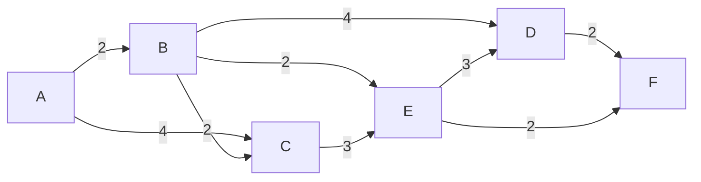

# Dijkstra

A greedy algorithm to calculate the shortest path between a single source and all other sources in a weighted directed graph.

**All edges must have positive values.**

- **Runtime:** O(v^2) (where v is the number of vertices)
- **Memory:**
