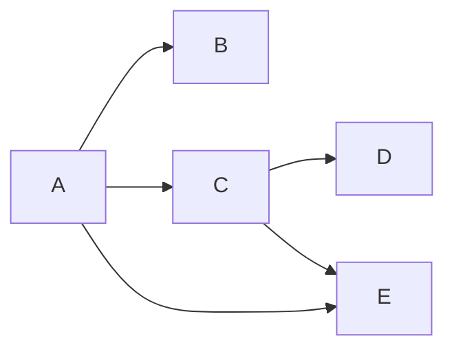
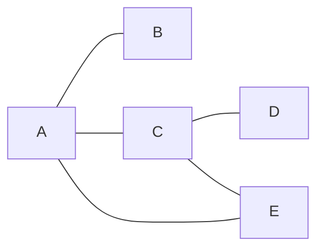

# Graphs 🕸️

Think of a graph like a network. A graph is a set of vertices connected by edges. A graph can be directed or un-directed.

**Directed**

**Undirected**

## Time complexity analysis

| Operation     | Time complexity |
| ------------- | --------------- |
| Add vertex    | O(1)            |
| Add edge      | O(1)            |
| Remove vertex | O(V + E)        |
| Remove edge   | O(E)            |
| Query         | O(V)            |

## API

- **addVertex(value: number | string):** Adds a new vertex to the graph.
- **addEdge(value1: Value, value2: Value):** Adds an edge from `value1` to `value2`.

## Coding problems
