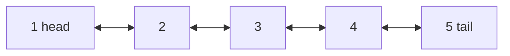

# Doubly-Linked Lists ⛓️

In a doubly linked list we have a double link; one to the next node and another one to the previous node.

## Time complexity analysis

| Operation          | Time complexity |
| ------------------ | --------------- |
| Access nth element | O(N)            |
| Insert             | O(1)            |
| Delete             | O(1)            |

## API

- **push(value: number):** Add an element to the end of the linked list.
- **insert(value: number, index: number):** Inserts a new element at the specified position.
- **pop():** Remove and return the last element from the linked list.
- **at(index: number):** Return an element from a given index (but don't remove it).
- **remove(value: number):** Removes an element from the list.
- **removeAt(index: number):** Delete an item from a given index.
- **isEmpty():** Return a boolean indicating whether the list is empty.
