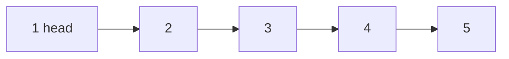

# Singly-Linked Lists ⛓️

The linked list data structure enables a more performant way of working with data collections, unlike arrays, in linked lists elements are not placed contiguously in memory. Instead every element consist of a node that stores the element itself and a reference to the next element. This means that adding or removing elements doesn't require any shifting.



## Time complexity analysis

| Operation          | Time complexity |
| ------------------ | --------------- |
| Access nth element | O(N)            |
| Insert             | O(1)            |
| Delete             | O(1)            |

## API

- **push(value: number):** Add an element to the end of the linked list.
- **insert(value: number, index: number):** Inserts a new element at the specified position.
- **pop():** Remove and return the last element from the linked list.
- **at(index: number):** Return an element from a given index (but don't remove it).
- **remove(value: number):** Removes an element from the list.
- **removeAt(index: number):** Delete an item from a given index.
- **isEmpty():** Return a boolean indicating whether the list is empty.

## Coding problems

<details>
  <summary>Problem 1. Partition</summary>

Partition a linked list around a value x, such that all nodes less than x come before all nodes greater than or equal to x.

IMPORTANT: x can appear anywhere in the "right partition; it does not need to appear between the left and right partitions."

</details>

<details>
  <summary>Problem 2. Sum Lists</summary>
  
  Having 2 number represented by a linked list, where each node contains a single digit. The digits are stored in reverse order. Write a function that adds them and return the sum as a linked list. Example:

```text
(7 -> 1 -> 6) + (5 -> 9 -> 2) = (2 -> 1 -> 9)
```

</details>
