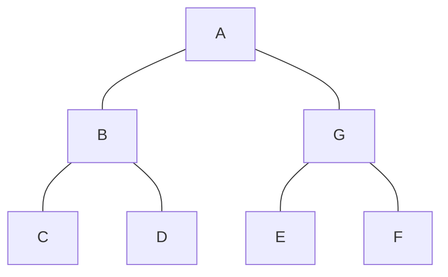

# Adelson-Velskii and Landi's (AVL) tree 🌳

In a binary tree, it could happen that a branch grows it's high a lot more than other branches in the tree, causing performance issues when adding, removing, and searching for nodes. The AVL tree solves this problem. The AVL tree is a self-balancing binary search tree meaning tha the height of the left and right subtree of any node differs by 1 at most.
The tree will become a complete tree while adding or removing nodes.

