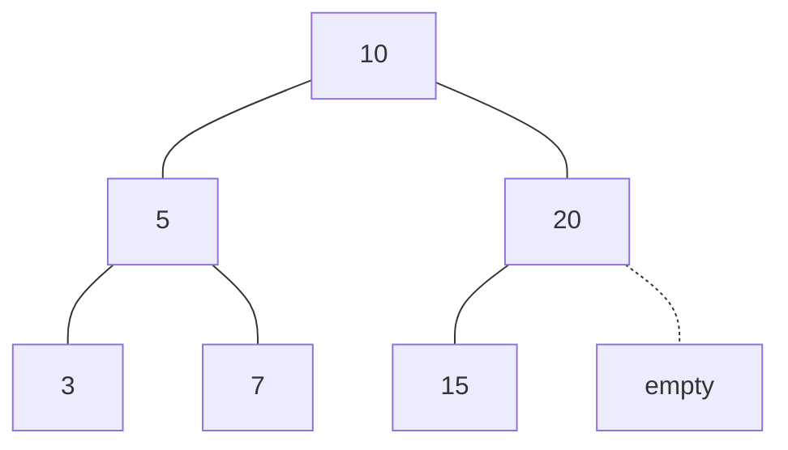

# Binary heap 🌳

The binary heap is a kind of binary tree with the following properties:

It is a complete binary tree. All levels of the tree have both children (left and right) with the exception of the rightmost elements on the last level.

**Complete binary tree example**



A binary heap is either a min-heap or a max-heap. The min-heap allows to quickly extract the minimum value of the tree whereas the max-heap allows the same for the maximum value of the tree. In the min-heap each node is smaller than its children, the root therefore, is the the minimum value of the tree. In the max-heap each node is greater than or equal to each of its child nodes, the root therefore, is the maximum value of the tree. This is known as the heap property.

Notice that the above also mean that although the binary heap is a binary tree, it is not necessarily a **binary search tree (BST)** because in a BST the left child is always smaller than its parent and the right child is always greater as well.

Even though it's nice to have a mental model of a heap as a complete binary tree with pointers, they are normally implemented as an array as they provide very low memory overhead.

Above binary heap can also be represented with the following array:

```ts
const heap = [10, 5, 20, 3, 7, 15];
```

The left and right child nodes can be calculated manipulating the array indexes.

Given a node at index `n`, let's try and figure out a formula to find the index for its left child node.

- The index of the node to the left of the index 0 is 1 `left(0) = 1`
- The index of the node to the left of the index 1 is 2 `left(1) = 3`
- The index of the node to the left of the index 2 is 5 `left(3) = 5`

The key realization for the formula is that for an item at index `n`, we will essentially have to skip `n` spaces on its right, and one more to arrive at its left node.

`left(n) = 2n + 1`

Now the right child node is simply the left node plus one

`right(n) = 2n + 2`

Now, Given a node at index `n`, let's try and figure out a formula to find the index for its parent.

`parent(n) = is even ? (n - 2) / 2 : (n - 1) / 2`

The right node index will always be even and the left node index will always be odd so, we use this to go back from our left and right formulas.
