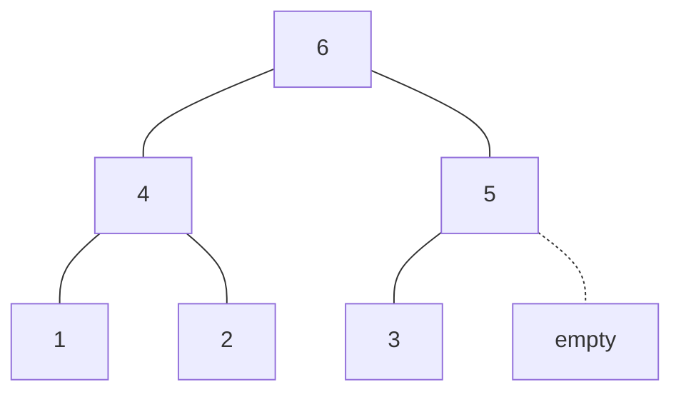

# Max heap

The max-heap allows to quickly extract the maximum value of the tree. In the max-heap each node is greater than its children, the root therefore, is the the maximum value of the tree.

## Time complexity analysis

| Operation | Time complexity |
| --------- | --------------- |
| Insert    | O(log n)        |
| Extract   | O(log n)        |

## API

- **insert(value):** Inserts a new value into the heap.
- **extract():** Removes the maximum value (max heap) and returns it.
