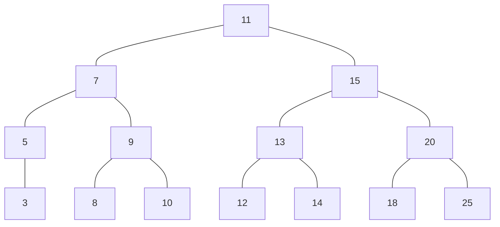

# Binary Search Tree (BST) 🌳

A binary search tree is a type of tree where each node has two children at most: one left child and one right child. Nodes with lesser values go to the left-hand side and nodes with greater values go on the right-hand side.

## Time complexity analysis

| Operation          | Time complexity |
| ------------------ | --------------- |
| Access nth element | O(LogN)         |
| Insert             | O(LogN)         |
| Delete             | O(LogN)         |

## API

- **insert(value):** Inserts a new key in the tree.
- **search(value):** Searches for the key in the tree. Returns true/false accordingly.
- **inOrderTraverse(callback):** Visits all the nodes in the tree using in-order traverse.
- **preOrderTraverse(callback):** Visits all the nodes in the tree using pre-order traverse.
- **postOrderTraverse(callback):** Visits all the nodes in the tree using post-order traverse.
- **min():** Returns the minimum value in the tree.
- **max():** Returns the maximum value in the tree.
- **remove(value):** Removes the key from the tree.

## Coding problems
