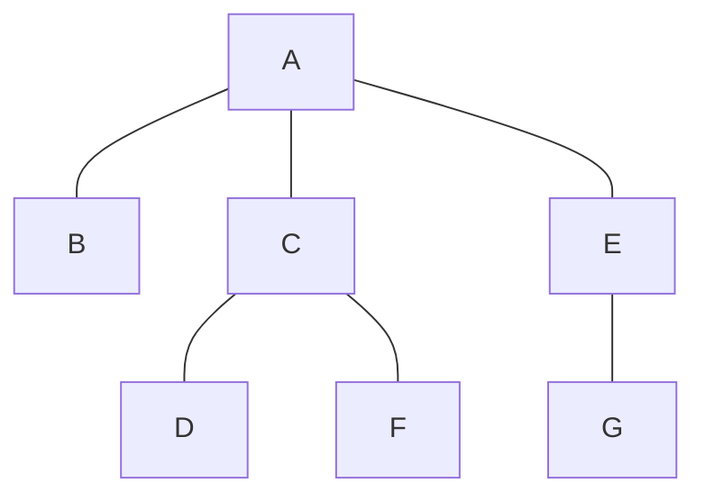
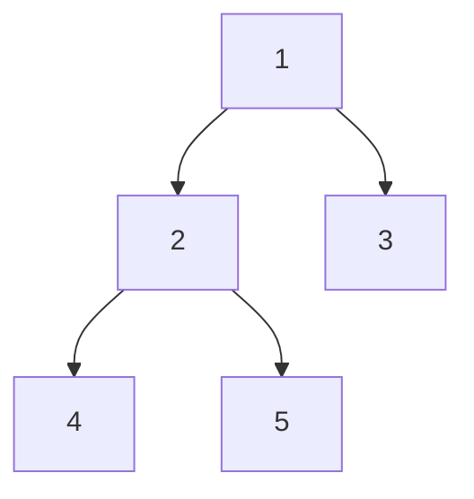

# Tree 🌳

A tree is a type of graph. It is in fact an acyclic graph where there is a root node with zero or more child nodes each child node having zero or more nodes and so on.



## API

- **insert(parent, node):** Inserts a node under the specified parent node.
- **search(value):** Searches a value within the tree.

## Coding problems

<details>
  <summary>Problem 1. Print Right View of a Binary Tree</summary>
  
  Given a Binary Tree, print Right view of it. Right view of a Binary Tree is set of nodes visible when tree is visited from Right side.
</details>

<details>
  <summary>Problem 2. Print the height of the binary tree</summary>
  
  You're given a binary tree T. Write a code to print the height of the binary tree. Height of empty tree is -1, height of tree with one node is 0 and height of below tree is 2.



</details>

<details>
  <summary>Problem 3. Connect nodes at same level</summary>
  Write a function to connect all the adjacent nodes at the same level in a binary tree. Structure of the given Binary Tree node is like following.
  
  ```ts
  class Node<T = number> { 
    leftNode: Node<T> | null = null;
    rightNode: Node<T> | null = null;
    nextRight: Node<T> | null = null;
    value: T;
    
    constructor(value: T) {
      this.value = value;
    }
  }
  ```
</details>

<details>
  <summary>Problem 4. Serialize and deserialize a binary tree</summary>
  
  Given a binary tree, write a program to serialize the tree into a string and then deserialize the string back into the tree.
  
  Example, for the following tree:

  ```text
         1
       /   \
      2     3
     /  \   /  \ 
    4    5 6    7
  ```

The serialized string would be: `1,2,4,#,#,5,#,#,3,6,#,#,7,#,#`

</details>