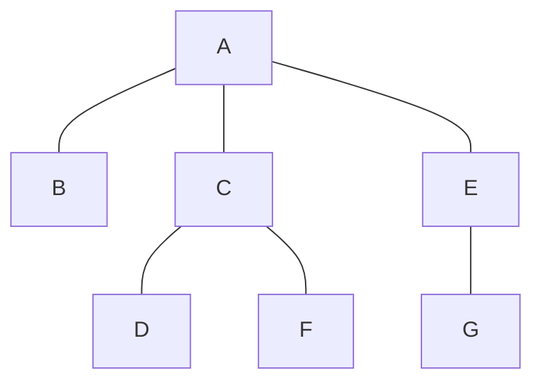

# Tree 🌳

A tree is a type of graph. It is in fact an acyclic graph where there is a root node with zero or more child nodes each child node having zero or more nodes and so on.

## API

- **insert(parent, node):** Inserts a node under the specified parent node.
- **search(value):** Searches a value within the tree.

## Coding problems

  
Problem 1. Print Right View of a Binary Tree

Given a Binary Tree, print Right view of it. Right view of a Binary Tree is set of nodes visible when tree is visited from Right side.

